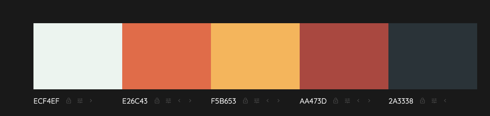
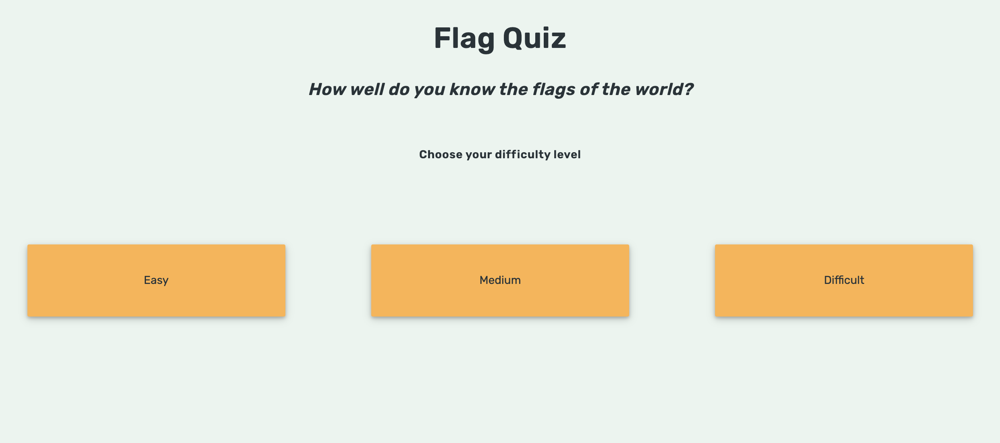
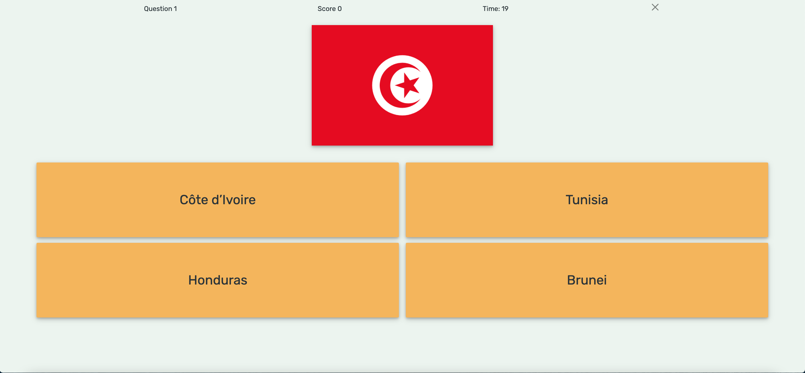

# Flag-Quiz-Milestone-Project-2

# **Flag Quiz Website**

[A mock-up of the website on different devices](assets/images/quizscreenshot.png "Mock Up of the site")


## **Project Goals**

The primary goal of this site is to provide a fun and informative interactive quiz to test a user’s knowledge of country flags, giving users the opportunity to test their knowledge in three levels of difficulty. 

## **UX**

### *User goals*

The central audience for this site is people who would like to test their knowledge of flags or people who would like to learn more.

### **Site user goals**

Users to this site would like to test their knowledge of world flags in a quick, fun and interactive way as well as see their results and find out which flags they don't know whether they are a beginner or more advanced in terms of their prior flag knowledge. 
This site will meet these goals because

*   The site will be fully interactive and click based, not requiring any typing or spelling.
*   The quiz is available in three difficulty levels to suit different levels of prior knowledge.
*   Quizzes are randomised meaning that no one 30second will ever be in the same order or with the same multiple choice in order to encourage users to replay and improve their skills.
*   Quizzes will be timed at 30 seconds maximum meaning users do not have to make any long time commitments. 
*   A users will be able to save and track their score and compare it to other users. 
*   Visual feedback will be given to help users learn from their mistakes. 


## **Wireframes**

[Wireframes](./assets/wireframes.bmpr)

### **User Story**

As a user who would like to play a flag trivia quiz, I want:

1. An uncomplicated user interface which allows quick and initiative interaction.
2. Clear and easy to understand feedback.
3. The option to play a quiz that is suited to my knowledge level.
4. Recognition of my positive achievements.
5. Encouragement to continue playing in order to get better. 

**Design Choices**

The overall design of the site is based on a single page , no scrolling layout, with minimum text. Questions, answers and user-feedback are designed and presented as visually as possible with a bare-minimum of typing required(only to enter your name if a user would like to save their score)

* **Font**
There is only one font used throughout the quiz which is ..... This font was chosen for its visually clarity and ability to stand out on the page especially in its heavier weights. 

* **Colours**

The main consideration behind the colour palate of this site is having a primary background colour that does not clash with the flag. Colour is obviously very important in distinguishing flags and a background colour that is close to the white or red end of the spectrum would cause a lot of problems due to the high prevalence of those colours in world flags. As this site is aimed at front-end interactivity the buttons which a user presses needed to be of a significant contrast to the background as a call to action. Considering these factors, the following colour palette was created using the generator in [Colormind](http://colormind.io/bootstrap/)



See this website for flag colour statistics. [Statistics on flag Colours](https://www.crwflags.com/fotw/flags/xf-csts.html).
Red and green are used throughout the site for negative and positive feedback (for incorrect/correct and for time running out and scoring ) in order to create a quick and text-free way of passing information on to the user. 

## **Features**

### **Existing Features**

### **Homepage**



* The homepage has a main title which reads Flag Quiz, a sub-heading asking the user 'How well do you know the flags of the world?' and a final line of text inviting the user to choose a difficulty level.
* Below the text are three large buttons with the three levels of difficulty, easy, medium and difficult. 
* Upon clicking on one of the buttons the quiz will start. 

### **Main Quiz Page**  

 "Screenshot of the the main quiz page"
**Header**

* Along the top of the page the question number, score, countdown timer and a close button are evenly spread out. 
* If the user selects the correct answer the score information will flash green as it increases.
* When the user has only 10 seconds remaining the timer will start to flash red. 
* Upon clicking the close button the timer will pause and a modal will appear to ask the user if they are sure they want to quit the quiz or if they want to return to the game.

 **Flag**

* A flag appears centered below the header and will change every time a user selects and answer until the time runs out. 
* For mobile, tablet and laptop screen sizes the flags all have a fixed height and variable widths depending on the ratios of each flag. On larger screens the flags have a fixed width and variable height as the API does not allow for fixed height flags larger than 240pixels. 

**Answer buttons**

* Below the flags are four large buttons, each with the name of a different country.
* If the user selects the correct answer for the displayed flag, the button's colour will change to green and the next question will appear after 1 second.
* If the user selects an incorrect answer for the displayed flag, the selected button's background will change to red and the correct answer will be highlighted in green for 1 second until the next question appears. **

### **Scorepage**

* The default scorepage shows a message giving the user their total score and how many questions they answered in the 30 second time-limit.
* If the user scored zero the message will read "Oh dear... you score 0 points.
* If the user answers more questions wrong than right then the message will read 'Not bad, you scored (X) points".
* If the user answers more questions right than wrong then the message will read 'Well done, you scored (X) points".
* If the user answers all questions correct then the message will read 'Outstanding, you scored (X) points".
* If the user made mistakes, thumbnails of the flags they guessed incorrectly will appear with the correct answers below them. 
* There are two buttons below, one allowing the user to save their score, which when clicked will activate a modal prompting the user to enter their name.
* After the user has entered their name a table will appear showing the names and scores of all site users and the save score button will be hidden to prevent the user re-saving their score.
* The second button on the score page is a play again button which if pressed before saving the score, will ask the user if they want to save their score or if they want to go back to the homepage. 

## **Technologies Used**

### **Languages Used**
* [HTML5](https://html.com/html5/)
* [CSS3](https://www.w3.org/Style/CSS/Overview.en.html)
* [Javascript](https://www.javascript.com/)

## **Frameworks, Libraries & Programs Used**

* [Flagpedia](https://flagpedia.net/)
    * Used Flagpedia CDN in order to programmatically display the flags for the quiz. 

* [Bootstrap 5](https://getbootstrap.com/)
    * Imported CSS and JS, utilised grid system, navbar, form control and modals.

* [Google Fonts](https://fonts.google.com/)
    * Google fonts were used to import the font into the style.css file which is used on all pages throughout the project.

* [Git](https://git-scm.com/)
    * Git was used for version control by utilizing VSCode to commit to Git and Push to GitHub.

* [Github](https://github.com/)
    * GitHub is used to store the projects code after being pushed from Git.

* [VS Code](https://code.visualstudio.com/)
    * Code was written and edited using VS Code. 

* [Balsamiq](https://balsamiq.com/)
    * Balsamiq was used to create the wireframes during the design process.

* [Colormind](http://colormind.io/bootstrap/)
    * Used to generate a colour scheme for the site.

## **Testing**

Testing information can be found in this [separate file](testing.md). 


## Deployment
This site was developed using VS Code and live server and committed and pushed to Github through the VSCODE's source control options.

To deploy this page to GitHub Pages the following steps should be taken.

1. Log in to GitHub
2. Select the Milestone-Project-1 repository
3. Click on Settings
4. Select the Pages tab on the left sidebar.
5. In the Source settings click on the dropdown menu that is currently displaying None.
6. In the Select Branch settings change from None to Master.
7. Click on Save and the link to the deployed page will appear automatically in a green box with a tick stating "Your site is published".
8. To run this site locally the following steps should be taken.

To run this site locally the following steps should be taken.

### Run in Gitpod
To run this site locally the following steps should be taken.
Download Gitpod extension in chrome
Log into Gitpod
Go to the Github projects and select the milestone-project-1 repository.
There should be a green Gitpod button on the top right next to the Code button
Click the green Gitpod button
A Gitpod workspace will load allowing the user to work locally.

### Run in an alternate IDE

Go to GitHub projects and select the milestone-project-1 repository.
Above the list of files click the Code button.
In the Clone with HTTPs section, copy the clone URL for the repository.
In your local IDE open the terminal.
Change the current working directory to the desired location.
Type git clone, and then paste the URL you copied in Step 3.
Press Enter. Your local clone will be created.

## Credits

### Code

* Part of the addName function was adapted from an answer to this [stackoverflow post](https://stackoverflow.com/questions/1129216/sort-array-of-objects-by-string-property-value).

```javascript
let jsonStr = combinedStrings.replace(/(\w+:)|(\w+ :)/g, function(matchedStr) {
    return '"' + matchedStr.substring(0, matchedStr.length - 1) + '":';
  });
```

* The compare function was taken from an answer to this [stackoverflow post](https://stackoverflow.com/questions/1129216/sort-array-of-objects-by-string-property-value).

### Content

* This site relies heavily on Flagpedia API in order to display the flags during and after the quiz programmatically. 

* The difficulty levels and resulting scoring system were adapted from these [statistics] from Sporcle's Flag quiz showing how often flags were guessed correctly by players. 

### Acknowledgements 

My CodeInstitute mentor, Antonija Simic, for her thorough and constructive feedback.

My friends and family for helping testing the site.


