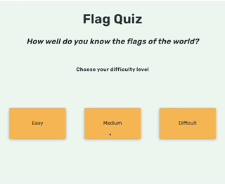
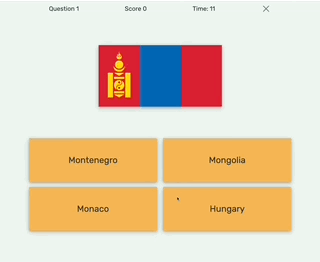
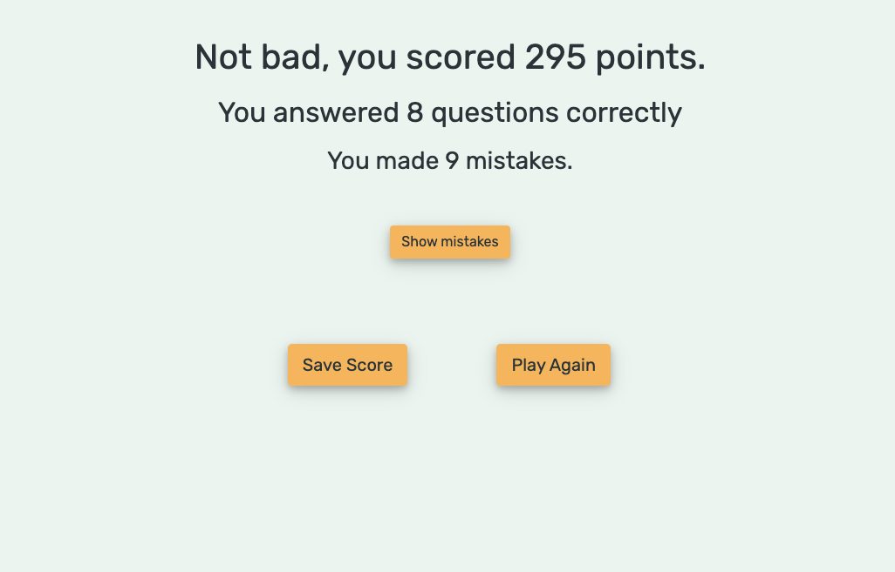
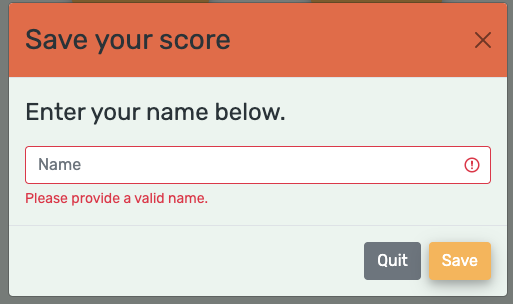
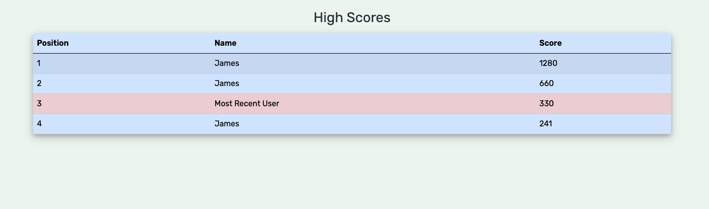
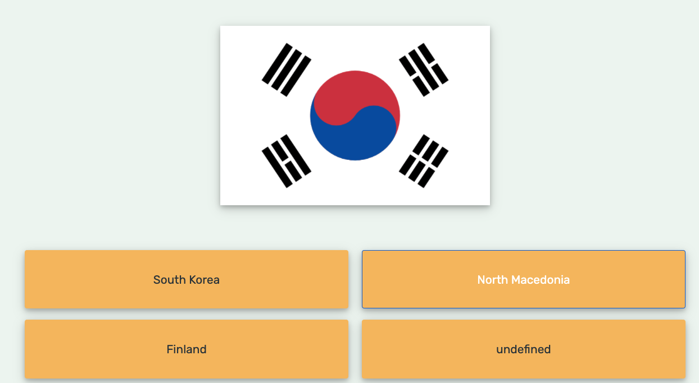

## **Testing**

### **Automated Testing**

The W3C Markup Validator and W3C CSS Validator Services were used to validate every page of the project to ensure there were no syntax errors in the project.JSlint was used to check the quality of the javascript code and Prettier was used to format code across the project. 

* [W3C Markup Validator](https://validator.w3.org/) 
* [W3C CSS Validator](https://jigsaw.w3.org/css-validator/)
* [JSLint](https://www.jslint.com/)
* [Prettier](https://prettier.io/)

### Lighthouse score

The lighthouse score report in google chrome developer tools was used on the site with the following result. 
[Lighthouse Score Report](assets/images/lighthouserscorereport.png)

## **Testing User Stories from User Experience (UX) Section**


As a user of this site, I want:

1. An uncomplicated user interface which allows quick and intuitive interaction.
    * The design of the site allows for simple navigation from one section to the next all via clearly defined and contrasted buttons. 
    * The user can start the quiz through just one click.
    * Answers are chosen by click only, allowing the user to go through the questions as quickly as they like without worrying about typing, spelling etc.

2. Clear and easy to understand feedback.
    * The user receives instant feedback for each question by a green background on the correct answer and a red background on the selected incorrect answer.
    * The user also sees the score instantly update and flash green every time they get an answer correct.
    * Once the quiz has been completed the users score is prominently displayed along with any errors they have made.

3. The option to play a quiz that is suited to my knowledge level.
    * The user has the chance to choose from three levels, easy, medium and difficult and does not have to play them in any order and is free to choose between them.
    
4. Recognition of my positive achievements.
    * The user is given the opportunity to save their score along with their name to add to the high score table where they can compare with other users or their previous scores. 
    * The user is rewarded for choosing a harder difficulty by achieving higher points for correctly guessing less well-recognised flags. 

5. Encouragement to continue playing in order to get better. 
    * In game feedback is given when the user chooses an incorrect answer as well as a visual summary of all the flag the user did not guess correctly at the end of the game, allowing them to make a mental note of any new or unfamiliar flags for them. 
    * Within a couple of clicks a user can restart a brand new game, and although the flags stay the same for each difficulty level, they will never appear in same order or with the same answer options allowing a unique experience no matter how many times they play the game. 

### **Browser Compatibility**

The Website was tested on Google Chrome , Internet Explorer, Microsoft Edge and Safari browsers.

### **Devices**

The website was designed on a MacBook Pro Laptop using a thunderbolt display and was tested on the following devices
* iPhone X 
* iPhone
* iPad 3
 

## **Manual Testing Procedure**

All steps were taken on Google Chrome, Firefox, Safari and Internet Explorer on a Thunderbolt Display at two different desktop screen resolutions and subsequently an iPhone X screen, iPad 3, and iPhone 8.

## **Elements on each page**

### **Homepage**

1. **Layout**
    * Check button arrangement is horizontal on desktop / laptop and table screen size
    * Check button arrangement is vertical on mobile screen. 
    * Check all text is clear and easy to read on different screen sizes.

2. **Buttons**
    * Hover over each button to check effect works.
    * Click 'Easy' button to ensure it initialises a game with flags from the 'easy' category.
    * Click 'Medium' button to ensure it initialises a game with flags from the 'easy' category.
    * Click 'Difficult' button to ensure it initialises a game with flags from the 'easy' category.

### **Quiz Section**

**All testing steps were taken for 'easy', 'medium' and 'difficult' games**




1. **Header**

  * Check that question count starts at 1 and increases each time a question is selected.
  * Check that score starts at 0 and increases each time a correct answer is selected. 
  * Check that score animation works each time a correct answer is selected.
  * Check that timer starts at 30 seconds and decreases as game is played.
  * Check that timer flashing animation starts when it reaches 10 seconds.
  * Check that game finishes when timer reaches zero.
  * Click on the close game button to check that close game modal appears.
  * Check that timer is paused upon clicking the close game button.
  * Check that timer resumes at correct time when modal is closed or dismissed. 

2. **Close Quiz Modal**

  * Check text is clear and readable on multiple device sizes.
  * Click 'Yes button to check that the user is successfully brought back to the homepage.
  * Click 'No' button to check that user is successfully brought back to the quiz.
  * Click the 'X' close button on the modal to check that user is successfully brought back to the quiz.     

3. **Flag**

  * Check that flag appears successfully for each question.
  * Check that each flag is unique and there are no repeated flags.
  * Check that flag is easy to see and stands out against the background. 
  * Check that flag is 80px max height for small devices.
  * Check that flag is 120px max height for medium devices.   
  * Check that flag is 640px max width for large devices.

4. **Answer Buttons**

  * Check buttons are always aligned and arranged in two horizontal pairs. 
  * Check that for each question there are four unique country names with no repeats. 
  * Hover over each button to check effect is working.
  * Click on correct answer to check button changes to green and next question appears after 1 second.
  * Click on an incorrect answer to check button changes to red and the correct answer changes colour to red and next question appears after 1 second.    


    
### **Score Page**   

5. **User feedback**




  * Check that the correct score is displayed.
  * Check that the correct question count and correct answer count is displayed. 
  * Check that no error message is displayed when all questions have been answered correctly or when no questions have been answered.
  * Check that the  message 'Oh dear...' is displayed to the user when the score is 0. 
  * Check that the  message 'Not bad...' is displayed to the user when incorrect answers are greater than correct answers.
  * Check that the  message 'Well done...' is displayed to the user when correct answers are greater than incorrect answers.
  * Check that the  message 'Outstanding...' is displayed to the user when all answers are correct
  * Check that error message is displayed when mistakes are made.
  * Check that show mistakes button is displayed when at least 1 mistake has been made.
  * Check that the show mistakes button is hidden when the user has a perfect score or failed to answer any questions.
  * Click on show mistakes button to ensure that the error flags are displayed and button text changes to 'hide mistakes'.'
  * Click on show mistakes button again to ensure that the error flags are hidden and button text changes to 'show mistakes. 
  * Check that the error flags displayed match the mistakes made in the quiz.
  * Check that the save score button is hidden if the user score is 0. 

6. **Buttons**

  * Hover over 'Save Score' button to check effect is working. 
  * Check that 'Save Score' button launches the save score modal.
  * Hover over 'Play Again' button to check effect is working. 
  * Check that 'Play Again' button takes user back to the homepage after score has been saved.
  * Check that if the 'Play Again' button is clicked before score has been saved the quit without saving warning modal appears.

7. **Save Score Modal**

  * Check text is clear and readable on multiple device sizes.
  * Enter name and click 'Save' button to check that the modal closes, the high score table is displayed showing the user's details are highlighted and the save score button is hidden. 
  * Click 'Quit' button to check that user is successfully brought back to the score page.
  * Click the 'X' close button on the modal to check that user is successfully brought back to the score page.
  * Try to submit a blank user name to check custom Validation is working. 
  * Try to submit an invalid user name which begins with a '*" to check that custom validation is working.
    
 

8. **High Score Table**
  * Check that table is displayed once score has been saved and can be read clearly on all relevant device sizes. 
  * Check that the current user's score is present in the table. 
  * Check that the current user's score and name is highlighted in the table.
  * Check that table is arranged from highest score to lowest score after each update. 
  * Click on 'Play Again' button to check that it takes user back to the homepage. 

    


## **Bugs**

### Solved Issues


1. **Flag Size Issues on different devices max heigh max-width.**

One of the first issues to arise was regarding the size of the flag images during the quiz. The Flagpedia API which the site uses offers flags with either fixed heights or fixed widths. To best suit the design of the site fixed heights were preferable as then the four option button would be able to stay horizontally aligned from question to question despite the dimensions of different flags. However, the flag images from the API only had a max fixed height size of 240px, which was far too small for laptop and large desktop screens. 
The solution for this issue was to take advantage of the fixed width flag sizes(which come in much larger resolutions ) and then apply a max height styling at various breakpoints to ensure that all quiz content remains visible on any viewport and the user does not have to scroll to see the answer options whilst playing the quiz. 

2. **Empty Answer Slot**

The quiz uses a generateQuestion function to choose a random flag to serve as the question and then 3 different country names to populate the question field. One issue that came up during the early stages was writing a function that would avoid any duplicate countries while not repeating any previous correct answers. 
``` javascript 
for (let optionCount = 0; optionCount < numberOfOptions; optionCount++) {
    let randomCountry = gameArray[Math.floor(Math.random() * gameArray.length)];
    if (
      !questionArray.includes(randomCountry) &&
      !correctAnswerArray.includes(randomCountry)
    ) {
      questionArray.push(randomCountry);
    } 
  }
```
This code led to no duplicate correct answers or options but did occasionally lead to the issue of  one of the options being undefined as shown below.



The issue was caused by the fact that function needed to loop four times in order to fill the answer array, but if one of the random countries generated had previuosly been selected it would not be added to the question array which prevented duplicates but it did leave one of the four options undefined.
In order to solve this issue I simply added an else statement to the above code which in the case of the random country begin already chosen would remove 1 from the loop count to ensure that the question array always had four unique countries and never displayed an undefined option. 

``` javascript 
for (let optionCount = 0; optionCount < numberOfOptions; optionCount++) {
    let randomCountry = gameArray[Math.floor(Math.random() * gameArray.length)];
    if (
      !questionArray.includes(randomCountry) &&
      !correctAnswerArray.includes(randomCountry)
    ) {
      questionArray.push(randomCountry);
    } 
    else{
        optionCount -= 1
    }
  }
```
3. **Issues with saving scores in local storage.**

As one of the main goals of this site is to help users improve their knowledge of flags over tie, the ability to save your score and compare it the past scores was important. For the scope of this project in the frontend interactive module saving scores in a database was not an option however the option of saving user scores in local storage in the browser appeared to be a neat solution.
One of the main issues I ran into when implementing this functionality was the fact that local storage stores all data as a string which meant that I would have to access the locally stored string, convert it into an object, add the new score and sort it to display to the user and then convert it back into a string to save it again in local storage. 
The original code for this process can be seen below. 
``` javascript
  let highScoreObject = JSON.parse(window.localStorage.getItem('highScores'))
   highScoreObject[userName] = score;
   sortedHighScores =sortObject(highScoreObject)
   window.localStorage.removeItem('highScores')
   window.localStorage.setItem('highScores', JSON.stringify(sortedHighScores))
   updateScoreboard(sortedHighScores)
 }
 ```
There were two fundamental issues with this code that had to be resolved. 
 
The first bug was that a user was not able to save multiple scores under the same name, as each time they tried to save a score with the same name it would overwrite an older save during the sorting step. 
 
The solution to this came by creating an unique ID variable by adding an asterisk to the username value and then sorting by score and removing the asterisk before re-saving it to local storage. Thus allowing multiple entries under the same name as shown by the screenshot below.

The second bug proved more difficult to solve in that the data being saved needed to stored and retrieved as an object array in the following format, 
 ```javascript
 [{name:userName:score:100}]
 ```
When converting this data to a string to save in local storage I was encountering problems in which the new score and user data was not being added to the high score object in the correct format, often leading to the local storage data becoming a series of nested object arrays as each username and score was added. 
A solution to this issue was inspired by an answer to this [stack overflow post](https://stackoverflow.com/questions/1086404/string-to-object-in-js). Many of the unsuccessful solutions I was attempting were due to the fact that the JSON parse method requires the object keys to be enclosed in quotes, meaning that the strings I was working with had to be formatted correctly as a JSON formatted string before applying the JSON.parse method. 
The final code to the addName function works as follows. 
 ```javascript 
 let highScoreString = window.localStorage.getItem("highScores");
    uniqueID = "*" + userName;
    user = { name: uniqueID, score: score };
    let userString = JSON.stringify(user);
    let combinedStrings = joinTwoStrings(highScoreString, userString);
    let jsonStr = combinedStrings.replace(
      /(\w+:)|(\w+ :)/g,
      function (matchedStr) {
        return '"' + matchedStr.substring(0, matchedStr.length - 1) + '":';
      }
    );
    sortedHighScores = JSON.parse(jsonStr);
    sortedHighScores.sort(compare);
    newScoreIndex = findHighScoreIndex(sortedHighScores);
    (sortedHighScores[newScoreIndex].name = uniqueID.slice(1));
    window.localStorage.removeItem("highScores");
    window.localStorage.setItem("highScores", JSON.stringify(sortedHighScores));
    updateScoreboard();
```
The username is first converted to a string and then combined with the string stored in local storage. A JSON string is created by replacing any single quotes with double quotes to match the JSON string format which can then be parsed into an object, sorted, displayed to the user and then sent back to local storage. Also note the unique ID marker is removed once the high scores have been sorted.      


4. **Building bootstrap figures in JS append child issue.**

In order to show the user their mistakes an incorrectAnswer array stores the country names the user got wrong then uses the Flagpedia API to show the flags with the correct country name below. In order to show the flags to user a showMistakes function was created that would programmatically build a collection of Bootstrap figures containing each flag with a figure caption below it. 
One issue that appeared was that bootstrap figures require the following layout,
```html
<figure class="figure">
  
  <figcaption class="figure-caption">A caption for the above image.</figcaption>
</figure>
```
Using the append child method to create multiple bootstrap figures resulted in the following layout error.
[Figure Error](assets/images/figureerror)

The figcaption element became the child of the img element which does not match the bootstrap required layout. In order to solve this the appendChild method was not used on the error flag image element and instead the insertBefore method was used, allowing the element to be a sibling of the errorFlag figure and thus achieving the correct layout needed by Bootstrap. 

``` javascript 
flagCaption.appendChild(captionText);
errorFlagFigure.appendChild(errorFlag);
errorFlag.parentNode.insertBefore(flagCaption, errorFlag.nextSibling);
 ```


5. **Custom Validation** 

The site uses a Bootstrap Modal to allow a user to save their score. This save-score-modal has one text input that captures the username and upon clicking the save button the user's score would be saved and the modal would close. One issue that arose was dealing with an empty input value. Giving the input a required attribute did not resolve the issue as the modal would close on submission automatically even if the input was not a valid one due to the data-bs-dismiss attribute of the modal. Removing this attribute would allow the standard HTML validation to work however the user would have to manually close the modal after saving a valid name.

The solution was to use Bootstrap custom validation adding the classes '-is-invalid' to an empty input field and then creating a JS function validateName to manually do the validation.
```javascript
var myModal = new bootstrap.Modal(document.getElementById('save-score-modal'))
function hideModal(){
  myModal.hide()
}
function validateName(event){
  userName = document.getElementById("nameInput").value
  if(userName== false || userName[0]==="*"){
  event.preventDefault()
  invalidNameWarning()
}
  else{addName()
  hideModal()}
}
function invalidNameWarning(){
 document.getElementById('nameInput').classList.add('is-invalid')
}
```
An added bonus of this feature was to check that the username does not include an asterisk at the beginning and thus conflicting the unique ID marker that the addName function generates.